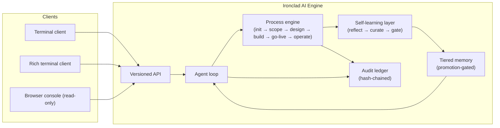

# Ironclad AI

**An armored, autonomous software‑engineering orchestrator.**

Ironclad AI takes a plain‑English request and carries it all the way from idea
to a running, tested, deployed change — planning the work, writing the code,
verifying it against real evidence, and learning from what happened so the
next run is better than the last. It runs headless on your own infrastructure,
speaks a versioned API from day one, and is reachable from a terminal client,
a rich TypeScript client, or a read‑only browser console — whichever fits the
moment.

> **Status:** in active development. This repository is a preview of the
> product documentation — no code is published here.

---

## What it does

- **Runs full software delivery cycles autonomously.** Init → scope → design →
  build → go‑live → operate. Every phase produces real, checkable evidence —
  not a summary of what an agent claims it did.
- **Learns from its own work.** Every run is reflected on, distilled into
  lessons, and — only after passing a gate — folded into a growing base of
  project and organization‑wide knowledge. Nothing gets promoted to long‑term
  memory without going through an approval step first.
- **Remembers what matters, safely.** A tiered memory model separates raw
  experience from reviewed, trusted knowledge. Retrieval is relevance‑ and
  budget‑bounded, so a flood of weak matches never drowns out the few that
  actually matter, and one project's knowledge never leaks into another's.
- **Never guesses at the boundary.** Every consequential action — writing a
  file, approving a promotion, executing a tool — passes through an
  explicit, auditable gate. Unknown input or an unreachable dependency
  produces a structured refusal, never a silent guess.
- **Meets you where you work.** A terminal client for fast, keyboard‑first
  operation; a richer TypeScript client for deeper interaction; a browser
  console for watching a run unfold in real time. All three speak the same
  versioned API — nothing is a special case.
- **Runs anywhere your team does.** A single headless engine, deployable as a
  Docker image or a native installer, with native clients across Windows,
  Linux, and macOS.

---

## How it fits together

Every run is driven by the same process engine, observed through the same
API, and leaves the same kind of trail behind: an append‑only, tamper‑evident
record of what was decided, what was approved, and what actually happened.

---

## See it in action

Curious what a real run looks like end to end? Read the
**[playbook](docs/playbook.md)** — a worked example that follows a single
feature request from a one‑line ask through to a deployed, tested change.

---

## Learn more

- **[Playbook](docs/playbook.md)** — a worked example, start to finish
- **[Architecture](docs/architecture.md)** — how the pieces fit together in
  more depth

---

*Ironclad AI is built and maintained by MJW Consulting.*
