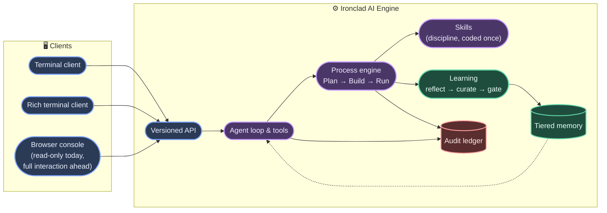

# Ironclad AI — Community Edition

**An armored, autonomous process orchestrator.**

At its core, Ironclad AI is a configurable engine for running multi‑step
processes autonomously, end to end: **Plan → Build → Run.** A process isn't
hardcoded into the engine; it's defined, the same way a build pipeline or an
infrastructure playbook is defined, and Ironclad carries it out — planning
the work, executing it, verifying the result against real evidence, and
learning from what happened so the next run is better than the last. It
runs headless on your own infrastructure, speaks a versioned API from day
one, and is reachable from a terminal client on Windows, Linux, or macOS, a
rich TypeScript client, or a browser console — whichever fits the moment.

The first process it ships with is software engineering, end to end — from
a plain‑English request to a deployed, tested change. That's the flagship
example throughout this documentation, but it's an instance of what the
engine does, not the whole of what it is.

> **Status:** in active development. This repository is a preview of the
> product documentation — no code is published here.

---

## What it does

- **Runs any defined multi‑step process autonomously.** A process is
  declared, not hardcoded into the engine — the same machine that runs
  software engineering end to end (Plan → Build → Run) can run any other
  multi‑step process defined the same way. Every phase produces real,
  checkable evidence — not a summary of what an agent claims it did.
- **Codes discipline once, as skills.** How to plan a change, test it, review
  it, hand it off cleanly — each is a small, versioned skill definition, not
  something re‑explained every session. A recurring failure pattern can
  become a new skill on its own, so the fix applies everywhere going
  forward, not just to the run that found it.
- **Learns from its own work.** Every run is reflected on, distilled into
  lessons, and — only after passing a gate — folded into a growing base of
  project and organization‑wide knowledge. Nothing gets promoted to long‑term
  memory without going through an approval step first.
- **Remembers what matters, safely.** A tiered memory model separates raw
  experience from reviewed, trusted knowledge. Retrieval is relevance‑ and
  budget‑bounded, so a flood of weak matches never drowns out the few that
  actually matter, and one project's knowledge never leaks into another's.
- **Never guesses at the boundary.** Every consequential action — writing a
  file, approving a promotion, executing a tool — passes through an
  explicit, auditable gate. Unknown input or an unreachable dependency
  produces a structured refusal, never a silent guess.
- **Is API‑first, all the way through.** There is exactly one versioned API
  surface, and every caller uses it the same way — the terminal client, the
  browser console, and the engine's own internal machinery all go through
  the identical handlers. Nothing has a private shortcut, so nothing can
  drift out of sync with what the API actually promises.
- **Meets you where you work.** A terminal client for fast, keyboard‑first
  operation; a richer TypeScript client for deeper interaction; a browser
  console for watching a run unfold in real time — currently read‑only, on
  its way to full interaction. All three speak that same API — nothing is
  a special case.
- **Runs anywhere your team does.** A single headless engine, deployable as
  a Docker image or a native installer. The CLI runs natively on all three
  major platforms — Windows, Linux, and macOS — no matter which one your
  team develops on.
- **Proves itself end to end.** A complete Plan → Build → Run cycle — start
  a project, take it through every phase, watch it go live — runs entirely
  through that one API, start to finish, deterministically and against
  real, checkable evidence at every step. Not a demo path; the same route
  every real run takes.

---

## How it fits together

Every run is driven by the same process engine, guided by the same coded
discipline, observed through the same API, and leaves the same kind of
trail behind: an append‑only, tamper‑evident record of what was decided,
what was approved, and what actually happened. See
**[Architecture](docs/architecture.md)** for how skills, learning, and
memory actually connect to each other.

---

## See it in action

Curious what using it actually looks like? **[Take a look at the
clients](docs/screens.md)** — the terminal, the rich terminal, and the
browser console, all watching the same run. Or read the
**[playbook](docs/playbook.md)** — a worked example that follows a single
feature request from a one‑line ask through to a deployed, tested change.

---

## Learn more

- **[The clients](docs/screens.md)** — what the terminal, rich terminal,
  and browser console actually look like
- **[Playbook](docs/playbook.md)** — a worked example, start to finish
- **[Architecture](docs/architecture.md)** — how the pieces fit together in
  more depth

---

*Ironclad AI is built and maintained by MJWC‑AI-LAB. Developed in the UAE.*
