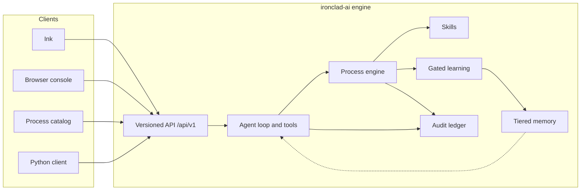
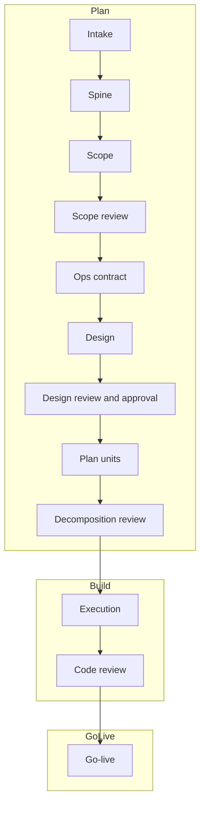

# ironclad-ai

**An armored, autonomous process orchestrator.**

Most coding agents are a chat window with tools. That is fine for a spike.
It is a poor way to ship a change you have to live with.

ironclad-ai runs a **defined process** on your own infrastructure. You write
the request in plain language. The engine turns it into scoped work, reviews
it against evidence, and stops at every gate that needs a human. It does not
guess when it cannot prove the next step.

The first process it ships is software engineering — from a one-line ask to
a verified, go-live-ready change. That is the flagship. It is not the whole
product. The same engine runs takeover, knowledge extraction, calibration,
and any process you publish into the workspace library.

> **Status.** ironclad-ai is in active development. This repository is the
> public documentation. Source and packages are not published here.

  

<em>Ink — the terminal client. One conversation. The process runs behind it.</em>

---

## Why this exists

If you have tried to put an LLM on real delivery work, you already know the
failure mode. The model sounds sure. The diff is large. The tests it mentions
were never run. Nobody can say which decision was approved, or by whom.

ironclad-ai is built for the other case: **you want the speed, and you still
want a trail.**

- **The process is visible.** Steps, gates, reviews, and reroutes are a
  versioned definition — not a prompt you hope the model will follow.
- **Approvals actually stop the run.** Scope, design, and go-live wait. Ink
  is where you decide. The browser does not sneak an approve button past you.
- **Evidence beats summaries.** A green claim is not a green suite. A
  refused tool call is a structured refusal, not a silent retry that hopes
  nobody notices.
- **It learns on purpose.** Lessons and long-term knowledge only land after
  a gate. One project's memory does not leak into another's.
- **One API, every client.** Ink, the browser console, the process catalog,
  and the Python automation client all speak `/api/v1`. Nothing gets a
  private shortcut.

---

## What you actually get

| Surface | What it is for |
|---|---|
| **Ink** | Chat-first terminal client. You talk, approve, and steer the run. `Ctrl+O` opens the project overlay (events, board, position, approvals, turns, incidents). |
| **Browser console** | Live observer: event log, board, pending gates, process position, codedir, telemetry. Optional chat is a feature gate. Approvals stay in Ink. |
| **Process catalog** | Workspace library of versioned processes. Inspect the materialized flow, publish a revision, pin a rulebook to a project. |
| **Engine CLI** | `ironclad serve`, `ironclad run`, `ironclad update`, plus config and memory commands. `ironclad run` starts or attaches to the workspace server and opens Ink. |
| **Python client** | Typed automation against the same versioned API. No second protocol. |

  

<em>The process catalog. Software development, takeover, extraction, calibration — versioned, grouped by use case.</em>

---

## A software-engineering run, for real

The shipped default rulebook is fourteen steps, not a slogan. Plan, build,
and go-live are how it *feels*. This is what it *does*:

Findings at a review gate do not get waved through. They reroute to the
step that has to fix them, with a bounded retry budget. Review-of-review
is on by default for the shipped software rulebooks. Patch and hotfix are
the same skeleton with a different change lane.

  

<em>sw_dev_default@1 — inherited base, overridden operator gates, review forks, reroute arrows. This is the definition the engine will run.</em>

The close-up of that flow:

  

While a run is live, the browser console shows where it is, what is waiting,
and what just happened — without giving the browser the authority to approve.

  

  

<em>Operator overview, then a project bound to a live run. Step 3 of 14, waiting on input. Codedir path redacted.</em>

Read the worked example in the **[playbook](docs/playbook.md)**.

---

## Not only software delivery

The engine does not care that the flagship process is software. A process
is a published definition: steps, variants, gates, refusal routes.

Shipped today:

| Process | Use case | What it is |
|---|---|---|
| `sw_dev_default` | Software development | Operator-gated scope and design on the fourteen-step base |
| `sw_dev_double_reviewed` | Software development | Same sequence, second opinion named explicitly |
| `sw_dev_unreviewed` | Software development | Primary reviews stay; review-of-review off |
| `sw_dev_patch` / `sw_dev_hotfix` | Software development | Same sequence, different change lane |
| `takeover` | Project adoption | Clone a repo, extract knowledge, baseline the gates, pin a rulebook |
| `rulebook_migration` | Project adoption | Pin an existing project onto a rulebook through audited waivers |
| `knowledge_extraction` | Knowledge extraction | Snapshot, extract, dedup, propose, gate, write project knowledge |
| `orchestrator_calibration` | Calibration | Exercise the configured orchestrator and persist a guarded verdict |

  

<em>takeover@1 — clone, extract, approve knowledge, then inherit the migration tail and pin the rulebook.</em>

  

---

## Discipline that does not live in the prompt

**Skills** encode how the work should be done — plan, specify, slice, build,
review, hand off — once, as versioned definitions. They are not re-explained
every session.

**Learning** reflects on runs and review findings, then waits. A pending
lesson is not memory. Approval is.

**Memory** is tiered. Raw episodes are not trusted knowledge. Promotion to
project lessons and released knowledge takes an exact-candidate gate.
Retrieval is project-scoped and budget-bounded.

**Audit** is append-only and hash-chained. Approvals, refusals, and
tool calls leave the same kind of record.

**Fail-closed** is the default. Unknown input, a missing dependency, or a
state the engine cannot resolve becomes a structured refusal. The run asks,
or it stops. It does not invent a third option.

---

## Where it runs

ironclad-ai is self-hosted.

| Host | Engine | Ink and automation |
|---|---|---|
| Linux | Native engine, or Docker | Native |
| Windows | Docker engine, or an operator-managed native runtime | Native Ink |
| macOS | Docker engine | Native Ink |

The engine binds loopback by default (`127.0.0.1:8484`). A wider bind
requires an active bearer-token profile. Startup refuses rather than
opening an unprotected socket.

See **[Getting started](docs/getting-started.md)** for the honest
install picture — this repository does not publish binaries.

---

## Learn more

- **[Playbook](docs/playbook.md)** — one feature request, through the real steps
- **[Architecture](docs/architecture.md)** — engine, API, skills, learning, memory
- **[Surfaces](docs/surfaces.md)** — Ink, console, catalog, CLI, Python client
- **[Processes](docs/processes.md)** — shipped definitions and how they compose
- **[Getting started](docs/getting-started.md)** — how you actually run it

---

*ironclad-ai is built and maintained by MJWC-AI-LAB. Developed in the UAE.*
*https://ironclad-ai.ae/*
