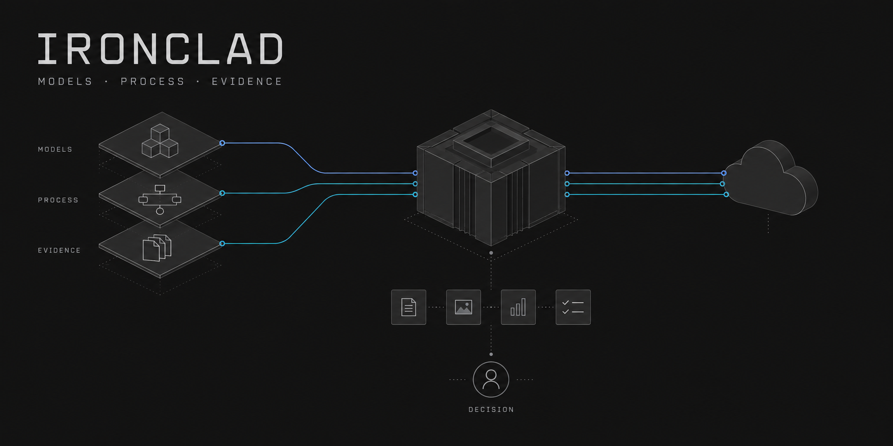

# IRONCLAD

**Models. Defined processes. Evidence.**

A self-hosted process orchestrator. Requests become scoped artifacts, reviewed changes and explicit operator decisions.

> Active development. This repository contains documentation; source and packages are not distributed here.

| Explore | See how it works |
|---|---|
| [Architecture](docs/architecture.md) | Runtime boundaries and state ownership |
| [Cloud models](docs/cloud-models.md) | Cloud APIs and local model replacement through the CLI Shim |
| [Coder harnesses](docs/coders/index.md) | Model overlays, role templates and native skills |
| [Processes](docs/processes.md) | Approvals, reviews, reroutes and receipts |
| [Worked example](docs/playbook.md) | One request through the delivery path |
| [Evidence](docs/evidence.md) | Diff application, build, tests and independent review |
| [Skills](docs/skills.md) | One definition, four native packages |
| [Memory](docs/memory.md) | Project knowledge, promotion and process authority |
| [Interfaces](docs/surfaces.md) | Ink, browser, catalog and automation |
| [Getting started](docs/getting-started.md) | Platforms, runtime and workspace |

*Conceptual illustrations introduce each topic. Labeled diagrams describe the implementation.*
