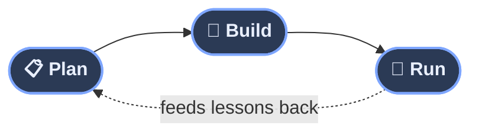
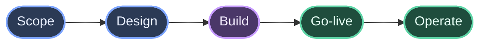
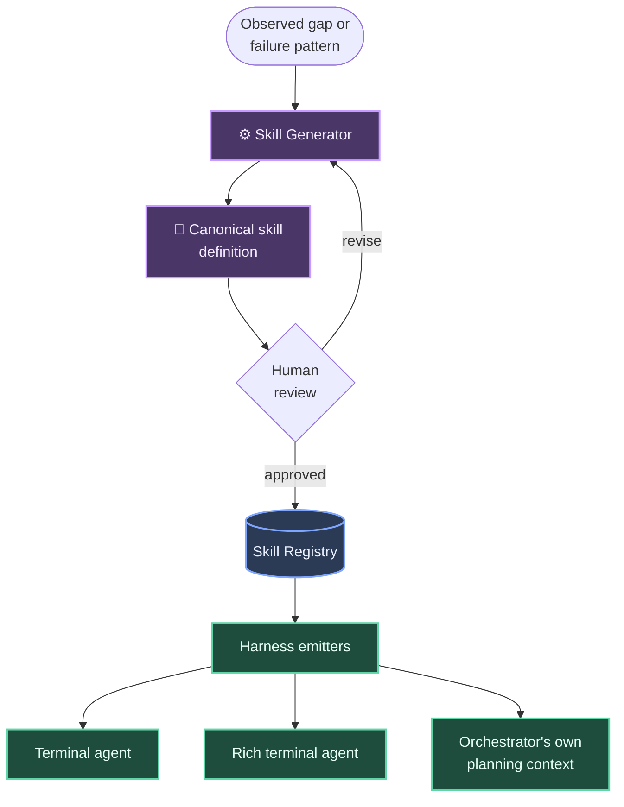
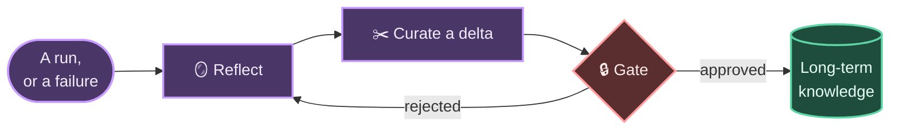
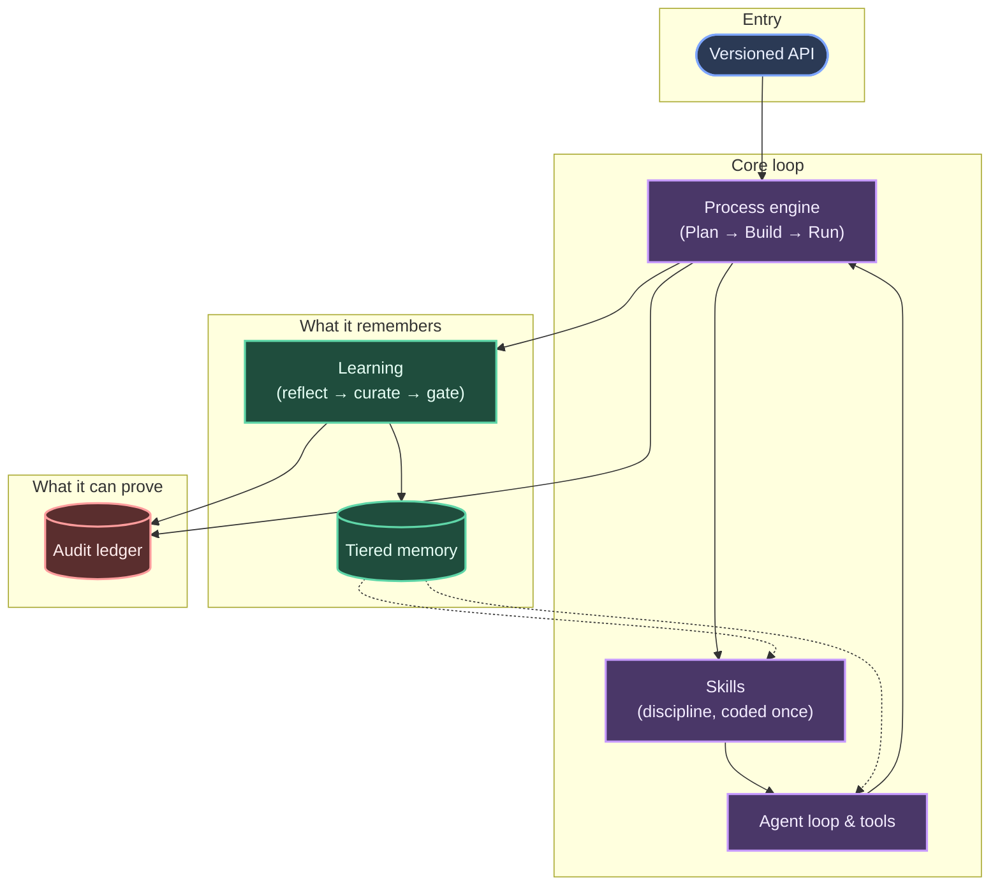

# Architecture

Ironclad AI is a single headless engine with one versioned, API‑first
surface — and that's not a description of the outer edge, it's true all
the way through. Every client — terminal, rich terminal, or browser — calls
the same API the engine's own internal machinery calls to drive itself.
There is no private shortcut for "internal" callers and no client‑specific
behavior that can quietly drift out of sync with what the API actually
promises. A complete Plan → Build → Run cycle — starting a project, taking
it through every phase, watching it go live — runs entirely over that one
API, end to end, deterministically and against real evidence at every
step. That's not a demo path; it's the same route every real run takes.

## A process engine, not a fixed pipeline

The core of Ironclad AI is a machine for running processes, not a hardcoded
one. A process is declared — its steps, their order, how they gate on each
other, what happens on failure — the same way a build pipeline or an
infrastructure playbook is declared. The engine carries out whatever process
it's given. Adding a new kind of process to run means writing a new process
definition; it never means changing the engine itself.

The product's standing ambition for any process it runs is the same
three‑part promise:

- **Plan** turns a request into a concrete, checkable plan and works out the
  approach before anything is built.
- **Build** implements against that plan, step by step, each step producing
  its own artifacts and evidence.
- **Run** verifies the result against real, reproducible checks, deploys it,
  and keeps watching it — feeding incidents and outcomes back into the next
  cycle.

### Software engineering: the first process definition

Software engineering is the first process Ironclad ships with — a full
Plan → Build → Run cycle for shipping a real change:

Scope and design make up the Plan phase for this specific process; go‑live
and operate make up Run. Every phase produces evidence a human can actually
check — a real test run, a real deployment, a real approval record — rather
than a summary an agent asserts happened.

## Agent loop and tools

At the center of every turn is an agent loop that holds a session, manages
its context as a conversation grows, and dispatches to a registry of tools —
file operations, shell execution, external lookups — each one running behind
the same approval and audit machinery as everything else. A tool call is
never a bare side effect: it is a scoped, logged, and — where it matters —
gated action.

## Skills: discipline, coded once

An agent's competence isn't just what model it runs on — it's *how* it's
told to work. Ironclad codes that discipline once, as small, versioned,
composable **skills**, instead of re‑explaining it in every session: how to
plan a change, how to write a test before the code it tests, how to review a
diff, how to hand work off cleanly. A skill is a single canonical
definition; a build step renders it into whatever shape each coding agent
actually consumes, so the definition never drifts out of sync with its
sixteen-or-so downstream copies.

A **skill generator** — itself a skill — turns a task description or an
observed failure pattern into a draft skill definition, complete with
checkable completion criteria, and runs its own quality lint over the
result before a human ever sees it: does it read as predictable
instruction rather than vague suggestion, does it avoid the failure shapes
Ironclad has already learned to watch for (a claim of completion with no
evidence behind it, test coverage that samples the obvious cases and
misses the distinct ones, a safety check quietly weakened without proving
it still catches what it's supposed to). Every skill maps to at least one
concrete kind of task, and every kind of task resolves to a skill — never a
silent gap. Usage is tracked: a skill that never fires, or keeps firing
when it shouldn't, becomes a candidate for revision or retirement, not a
permanent fixture nobody revisits.

## Learning: reflect, curate, gate

Skills encode discipline; learning is how the system accumulates
*experience* on top of that discipline. After a run — or a meaningful
failure — a reflection step distills what happened into a candidate
lesson: what went wrong, what the fix was, what to watch for next time.
Candidates are curated into deltas against what's already known — never a
blind overwrite of one lesson by another — and nothing reaches long‑term
storage without passing through an explicit approval gate first. Rejected
or contested lessons feed back into the same pipeline as accepted ones, so
the system's judgment about its *own* judgment keeps improving too, not
just its judgment about the work itself.

A recurring pattern — the same kind of mistake showing up across several
runs — doesn't just sit as a stored note either. It's a candidate for
becoming a *new skill*: the discipline that would have caught it, coded
once and applied everywhere going forward, rather than a lesson each new
session has to happen to remember on its own.

## Memory: tiered, gated, bounded

Knowledge lives in tiers, from raw project experience up to reviewed,
organization‑wide knowledge. Promotion between tiers always passes through
a gate bound to the *exact* content being promoted — not a loosely related
approval that happens to exist nearby. Retrieval is scoped to the caller's
project by default, with released, organization‑wide knowledge available
across projects only where that's explicitly appropriate. A relevance
floor sits alongside the usual size budget: a handful of genuinely
relevant items beats a pile of weak matches, every time.

## Governance and audit

Every consequential action leaves a durable, tamper‑evident trace: an
append‑only, hash‑chained ledger that can prove not just what happened, but
that the record of what happened hasn't been altered since. Approval flows,
incident handling, and escalation all read and write through this same
ledger, so there is one shared notion of truth about what the system has
done — not a scattered set of logs that can quietly disagree with each
other.

## Fail‑closed by default

Unknown input, an unreachable dependency, or a state the system can't
resolve produces a structured refusal — never a guess, never a silent
fallback. Where a choice must be made and the system can't make it safely
on its own, the run stops and asks rather than proceeding on an
assumption.

## How it all connects

None of these pieces work in isolation — a single run threads through all
of them:

The process engine drives every run and consults skills for how to do the
work well. What the agent loop actually does — and what happens to it — is
reflected on, curated, and, once approved, folded into memory that future
runs and future skill generations both draw on. Everything that mattered
enough to gate, approve, or refuse leaves its mark on one shared, provable
record. Change the process definition and you change *what* gets built;
the discipline, the memory, and the audit trail underneath stay exactly as
strict either way.
