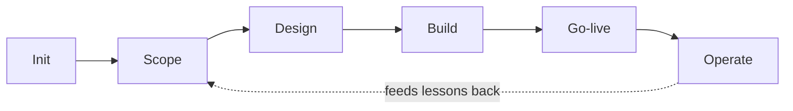
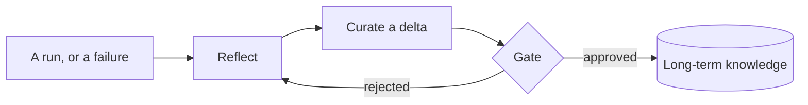

# Architecture

Ironclad AI is a single headless engine with a versioned, API‑first surface.
Every client — terminal, rich terminal, or browser — talks to the same API
the engine talks to itself, so there is no special internal shortcut and no
client‑specific behavior to keep in sync.

## The run lifecycle

A project moves through six phases, each producing evidence a human can
actually check rather than a summary an agent asserts:

- **Init** establishes the project and its working boundaries.
- **Scope** turns a request into a concrete, checkable plan.
- **Design** works out the approach before a line of implementation exists.
- **Build** implements against that plan, step by step, each step producing
  its own artifacts and evidence.
- **Go‑live** verifies the result against real, reproducible checks before
  anything is considered done.
- **Operate** watches the result in production, feeding incidents and
  outcomes back into the next cycle.

Every step is driven by a configurable process definition rather than a
fixed pipeline — the six phases are the shape, not a rigid script.

## Agent loop and tools

At the center of every turn is an agent loop that holds a session, manages
its context as a conversation grows, and dispatches to a registry of tools —
file operations, shell execution, external lookups — each one running behind
the same approval and audit machinery as everything else. A tool call is
never a bare side effect: it is a scoped, logged, and — where it matters —
gated action.

## Learning: reflect, curate, gate

After a run, or a meaningful failure, a reflection step distills what
happened into a candidate lesson: what went wrong, what the fix was, what to
watch for next time. Candidates are curated into deltas against what's
already known — never blind overwrites — and nothing reaches long‑term
storage without an explicit approval gate in between. Rejected or contested
lessons feed the same pipeline as accepted ones, so the system's judgment
about its own judgment improves too.

## Memory: tiered, gated, bounded

Knowledge lives in tiers, from raw project experience up to reviewed,
organization‑wide knowledge. Promotion between tiers always passes through a
gate bound to the *exact* content being promoted — not a loosely related
approval that happens to exist nearby. Retrieval is scoped to the caller's
project by default, with released, organization‑wide knowledge available
across projects only where that's explicitly appropriate. A relevance floor
sits alongside the usual size budget: a handful of genuinely relevant items
beats a pile of weak matches, every time.

## Governance and audit

Every consequential action leaves a durable, tamper‑evident trace: an
append‑only, hash‑chained ledger that can prove not just what happened, but
that the record of what happened hasn't been altered since. Approval flows,
incident handling, and escalation all read and write through this same
ledger, so there is one shared notion of truth about what the system has
done — not a scattered set of logs that can quietly disagree with each
other.

## Fail‑closed by default

Unknown input, an unreachable dependency, or a state the system can't
resolve produces a structured refusal — never a guess, never a silent
fallback. Where a choice must be made and the system can't make it safely on
its own, the run stops and asks rather than proceeding on an assumption.
