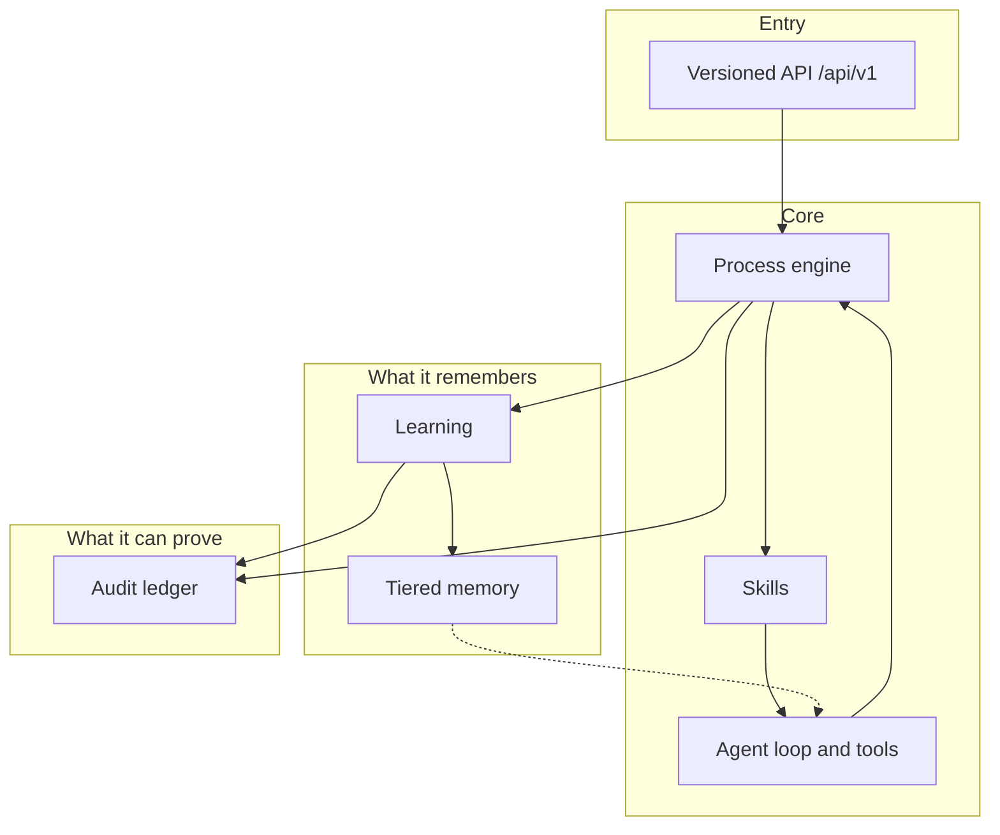

# Architecture

ironclad-ai is one headless engine with one versioned HTTP API. That is not a
slogan about the outer edge. Ink, the browser console, the process catalog,
the Python client, and the engine's own run machinery all go through `/api/v1`.
There is no private shortcut for "internal" callers, so a client cannot drift
from the contract the API actually promises.

## A process engine, not a hardcoded pipeline

A process is declared: ordered steps, variants, gates, fan-out, convergence
bounds, and what happens on refusal. The engine materializes that definition,
pins the snapshot to the run, and executes it. Adding a kind of work means
publishing a definition. It does not mean forking the engine.

Software engineering is the first shipped rulebook. Takeover, knowledge
extraction, and orchestrator calibration are the same machine with different
definitions. See [Processes](processes.md).

Change the process definition and you change *what* gets built. The
discipline, the memory rules, and the audit trail stay as strict either way.

## Agent loop and tools

Turns enter through a bounded input queue. Ink and the optional console chat
use the same admission path. While a turn is running you can keep queuing, or
steer the active turn. Cancellation addresses a durable turn id; a tool in
flight is not raced.

File operations, commands, and fetches run behind the same policy the rest of
the product uses: scoped paths, argv-only commands (`shell=False`), sandbox
selection, and a fetch guard that refuses private and loopback targets. A
tool call is a logged action. Where it matters, it is a gated one.

## Skills

Competence is not only the model. It is how the work is supposed to be done.
ironclad-ai keeps that as small, versioned **skills** — plan, specify, slice,
build, review, hand off — instead of re-explaining it every session.

A canonical skill maps to a kind of task. Production chat discloses the live
skill into the orchestrator context. Coding harnesses get the same discipline
through emitters; the source of truth stays one definition. Usage is recorded.
A skill that never fires, or keeps firing when it should not, is a candidate
for revision — not a fixture nobody revisits.

## Learning

After a run — and at production code review when a verdict actually rejects
work — reflection produces a candidate lesson. Candidates are curated against
what is already known. Nothing reaches the project learning store without an
operator approval on the hash-chained lifecycle. Rejected and conflicting
lessons stay visible to that gate. They do not silently overwrite memory.

A recurring pattern can become a new skill. That is a separate, reviewed
publication. A lesson is not a skill draft by default.

## Memory

Two axes, kept separate:

- **Substrate** — hot context, warm cache, cold store. Moving a row between
  substrates is not promotion.
- **Tier** — T0 raw episodes, T1 project lessons, T2 project or released
  knowledge. Promotion always takes an exact-candidate approval bound to the
  bytes being promoted.

Retrieval is project-scoped by default, relevance-floored, and size-bounded.
A handful of items that actually match beats a pile of weak ones. One
project's knowledge does not leak into another.

The shipped knowledge-extraction process snapshots a project, extracts typed
items without an LLM, deduplicates against T2, and waits at the same
promotion gate before any write.

## Governance and fail-closed

Consequential actions append to a durable, hash-chained audit ledger.
Approvals, waivers, and tool calls share that trail. A broken ledger refuses
mutating work rather than running without a record.

Unknown input, an unreachable dependency, or a state the engine cannot
resolve produces a structured refusal — never a guess, never a quiet
fallback. Where a choice must be made and cannot be made safely, the run
enters `awaiting_input` and asks.

Run state is explicit: `running`, `awaiting_input`, `paused`, `error`,
`completed`, `aborted`. Recovery from error takes an explicit retry. Skip and
abort are audited.

## Pinning

When a run starts, ironclad-ai pins the materialized process definition and
the effective configuration. Resume validates those snapshots. A later catalog
edit does not rewrite a run that is already in flight. Pinning a new rulebook
on a project affects the *next* run.

## Clients

There is one interactive terminal client: **Ink**. The browser console is the
observer (and, if enabled, a second chat seat on the same queue). The process
catalog is the library and configurator. The Python package is automation.
All of them are API clients. See [Surfaces](surfaces.md).
