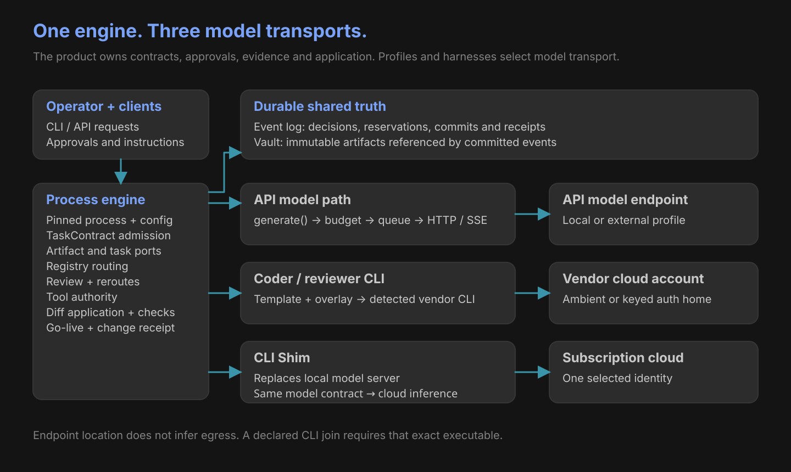

# Architecture

CLI Shim replaces the local model server for the orchestrator. The process engine stays local; inference moves to the configured vendor cloud through the same model contract.

| Shared truth | Owner | Lifetime |
|---|---|---|
| Process order, orchestrator model, subscriptions, tool policy | Validated run pin | Run |
| Coder / review model profiles | Live configuration → frozen selection | Dispatch attempt |
| Decisions, reservations, successful commits | Event log | Durable history |
| Scope, contract, Code, verification, receipt | Immutable artifact vault | Content-addressed revision |
| Model inventory and executable path | Host detection snapshot | Server process |
| Per-profile model queue | Shared generation limiter | Server process |
| CLI child and cleanup | Invoking runner | Request / assignment |

| Boundary | Required invariant |
|---|---|
| Model transport | Concrete profile and model identity resolve before dispatch |
| Declared CLI | Harness, detected executable, model and overlay agree |
| Codedir application | Validated proposal; recovery evidence precedes application |
| Review | Verdict is bound to its subject; acceptance names the pinned contract |
| Completion | Current Code has committed verification and a validated receipt |

[Model paths](cloud-models.md) · [Process order](processes.md) · [Evidence](evidence.md) · [Coder steering](coders/index.md)
