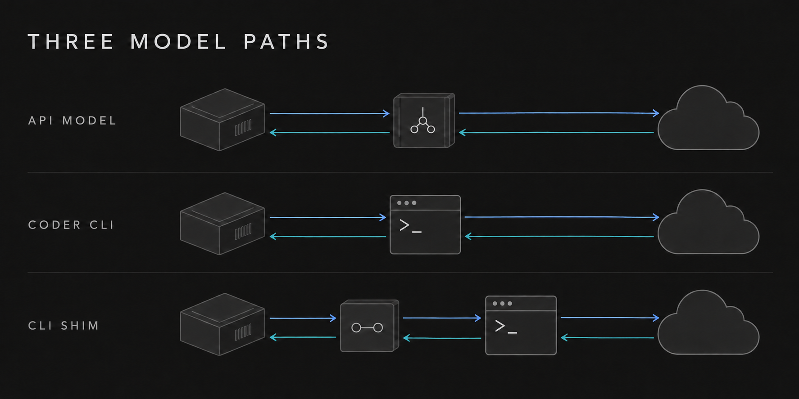
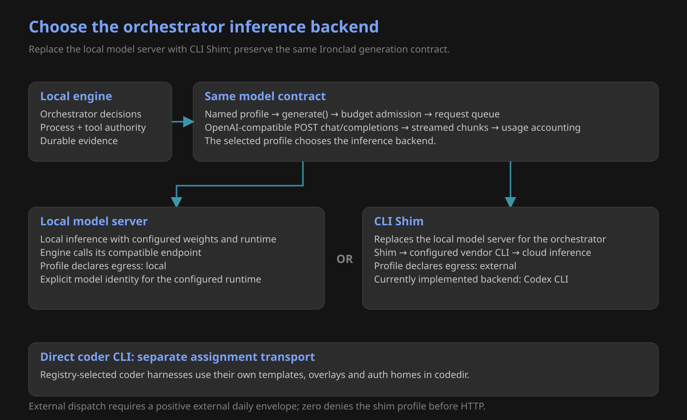
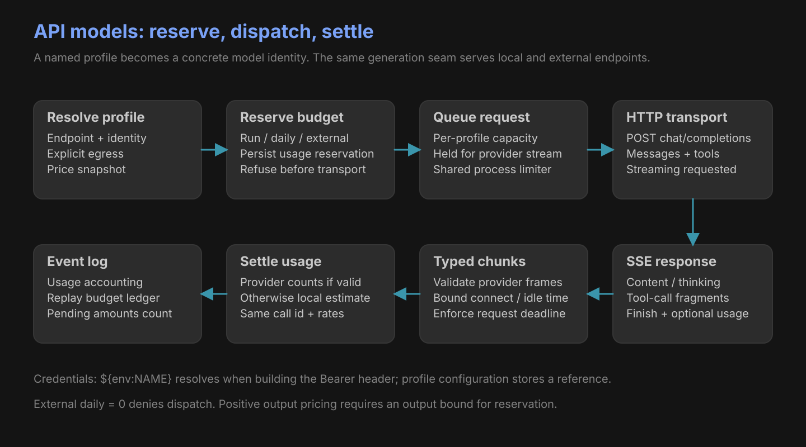
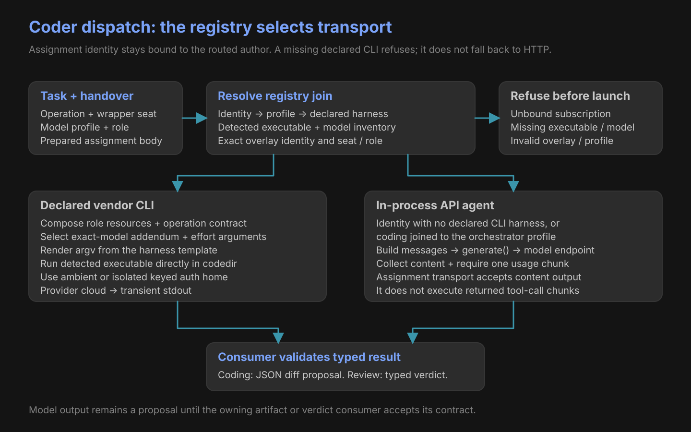
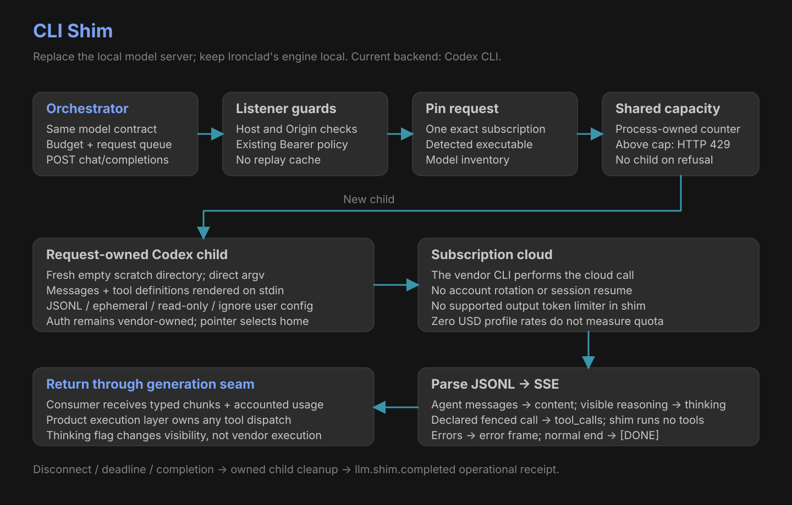

# Cloud models and subscriptions

Configure **CLI Shim in place of the local model server for Ironclad's orchestrator**. The engine stays local; the same generation contract sends inference through the configured vendor CLI to its cloud model.

*Conceptual overview. Detailed diagrams below describe implemented paths.*

| Orchestrator backend | Profile endpoint | Declared egress |
|---|---|---|
| Local model server | Model server’s compatible `/v1` | `local` |
| CLI Shim | Ironclad listener’s `/v1` | `external` |
| Direct cloud API | Provider’s compatible `/v1` | `external` |

## API model path

| Profile field | Meaning |
|---|---|
| `base_url` + `model` | OpenAI-compatible chat-completions endpoint and model argument |
| `model_identity` | Concrete hosted provider/model/version, or local weights/quantization/runtime |
| `egress` | Explicit `local` or `external`; never inferred from the URL |
| `api_key` | Environment reference resolved at transport; optional where supported |
| Input / output USD rates | Both required for external profiles |
| Request concurrency | Per-profile process queue |

## Coder and reviewer path

| Route | Model execution | Result |
|---|---|---|
| Declared vendor CLI | Exact detected binary, model overlay and template | Stdout proposal |
| Identity without a CLI harness | In-process generation seam | Content proposal |
| Coding profile absent | Resolved orchestrator profile through in-process generation | Same routed author; content proposal |
| Declared CLI missing | Refusal before launch | No HTTP substitution |

## CLI Shim

| Shim contract | Current behavior |
|---|---|
| Routes | `POST /v1/chat/completions`; `GET /v1/models` |
| Current backend | Codex CLI; hosted profile identity uses `provider: codex` |
| Subscription | One selected ambient or exact keyed identity |
| History | Posted messages, in order; ephemeral child |
| Tools | Declared call becomes SSE; the product execution layer owns execution |
| Output cap | Unsupported by the shim; positive direct `max_tokens` refuses |
| Thinking | Controls exposed reasoning; does not enforce vendor execution policy |
| Subscription quota | Not measured by zero-dollar profile accounting |
| Isolation | Empty scratch cwd and declared read-only mode; not arbitrary-path isolation |
| Retry | No shim retry loop |

External profiles require a positive external daily envelope. A loopback shim profile remains external.

[Architecture](architecture.md) · [Coder steering](coders/index.md) · [Evidence](evidence.md)
