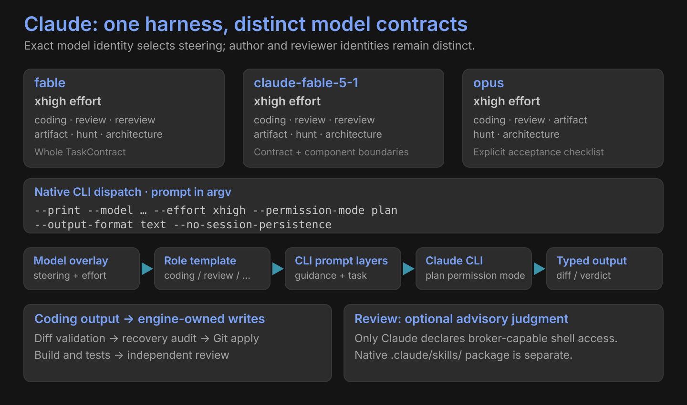

# Claude



| Exact model | Effort | Exact role templates | Steering |
|---|---|---|---|
| `fable` | `xhigh` | coding, review, rereview, artifact, hunt, architecture | Whole TaskContract; evidence first |
| `claude-fable-5-1` | `xhigh` | coding, review, rereview, artifact, hunt, architecture | Whole contract and component boundaries |
| `opus` | `xhigh` | coding, review, artifact, hunt, architecture | Explicit acceptance and verification checklist |

```text
--print --model … --effort xhigh --permission-mode plan
--output-format text --no-session-persistence <prompt>
```

The prompt travels in argv. Omitted-role overlays admit review and bundle-review seats; explicit coding roles select separate contracts. Author and reviewer identities remain distinct even when they share the harness.

## Optional review judgment

| Condition | Effect |
|---|---|
| Review seat + broker available + declared shell capability | Append advisory judgment command |
| Coding seat | No advisory judgment block |
| Advisory block exceeds the command-line limit | Recompose without the block |

Seat templates use PASS / BLOCK or CONFIRM / CHALLENGE guidance. Runtime Verdict outcomes are exact lowercase `approve` or `findings`.

Coding returns a JSON unified diff; the engine applies it and runs verification. Native `.claude/skills/` packages are a separate carrier.

[All harnesses](index.md) · [Native skills](../skills.md)
