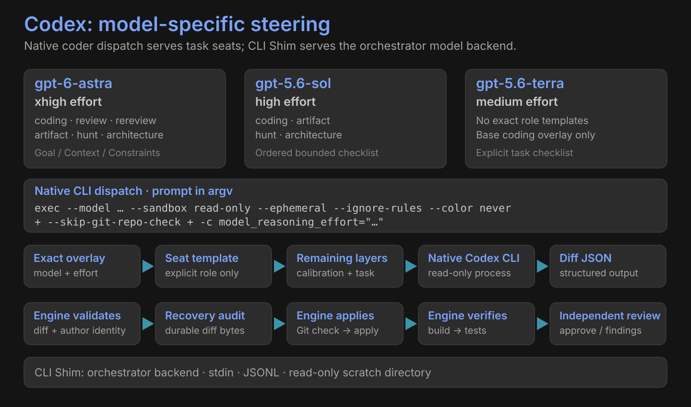

# Codex

| Exact model | Effort | Exact role templates | Steering |
|---|---|---|---|
| `gpt-6-astra` | `xhigh` | coding, review, rereview, artifact, hunt, architecture | Goal / Context / Constraints / Done when |
| `gpt-5.6-sol` | `high` | coding, artifact, hunt, architecture | Ordered bounded checklist |
| `gpt-5.6-terra` | `medium` | None | Base coding checklist |

## Native coder and orchestrator backend

| | Native CLI dispatch | CLI Shim |
|---|---|---|
| Purpose | Coding / review seat dispatch | Orchestrator model-server replacement |
| Prompt delivery | argv | stdin |
| Output | Plain stdout | JSONL; validated final message |
| Execution | `exec --model … --sandbox read-only --ephemeral` | `exec --json --model … --sandbox read-only --ephemeral` |
| Configuration | `--ignore-rules` | `--ignore-rules --ignore-user-config` |
| Model steering | Exact overlay + `model_reasoning_effort` | Configured provider identity and shim contract |
| Working directory | Project context | Empty scratch directory |

The CLI Shim replaces the local model-server connection for orchestrator requests. Currently implemented backend: Codex CLI. Native dispatch serves coding and review seats.

Native effort renders as `-c model_reasoning_effort="…"`. Both declared argv forms also use `--skip-git-repo-check --color never`.

## Availability is separate

| Declaration | Meaning |
|---|---|
| Packaged fallback inventory | `gpt-5.6-sol`, `gpt-5.6-terra` |
| Successful CLI inventory | Replaces fallback inventory; hidden slugs are excluded |
| Overlay presence | Provides steering; does not establish availability |

An explicit role needs its own template and identity-matching overlay. Terra has no exact role templates. The engine validates diff JSON and owns application, build and tests.

[All harnesses](index.md) · [Native skills](../skills.md)
