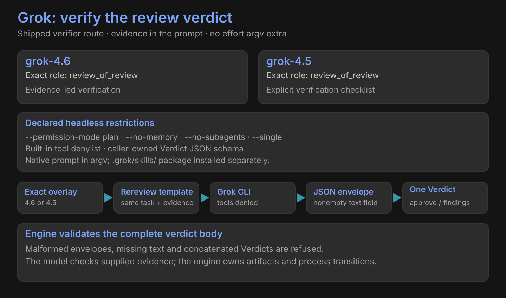

# Grok



| Exact model | Shipped seat | Exact template | Steering |
|---|---|---|---|
| `grok-4.6` | review_of_review | rereview | Evidence-led headless verification |
| `grok-4.5` | review_of_review | rereview | Explicit criteria / tests / documentation checklist |

No effort argv extra is declared.

```text
--model … --no-memory --no-subagents --permission-mode plan
--disallowed-tools … --json-schema <Verdict schema> --single <prompt>
```

## Output contract

| Stage | Required shape |
|---|---|
| CLI stdout | JSON object with nonempty string `text` |
| Extracted content | One complete Verdict; one JSON fence may be removed |
| Seat-template guidance | CONFIRM / CHALLENGE |
| Validated Verdict outcome | Exact lowercase `approve` or `findings` |
| Review verification | `approve` confirms the original decision; `findings` overturns it |
| Rejected | Missing text, malformed JSON, narration, multiple Verdicts, truncated content |

The denylist blocks terminal, file, web and subagent tools. Supplied evidence stays in the prompt. Native `.grok/skills/` packages remain separate from rereview templates.

[All harnesses](index.md) · [Native skills](../skills.md)
