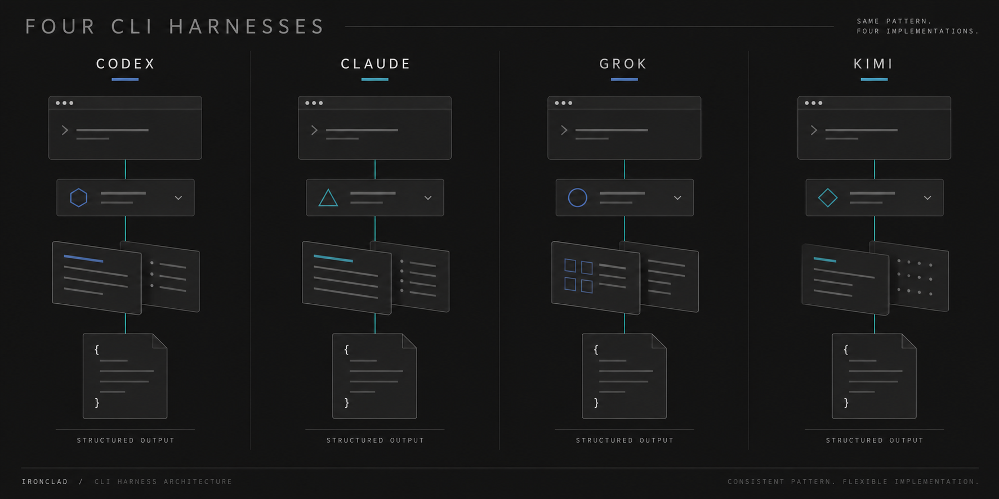
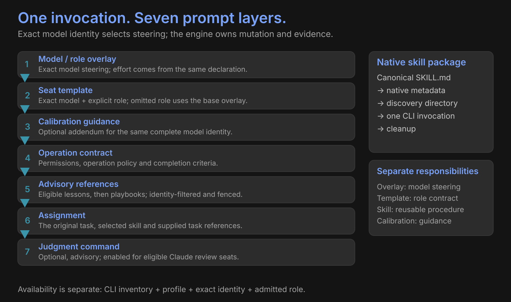
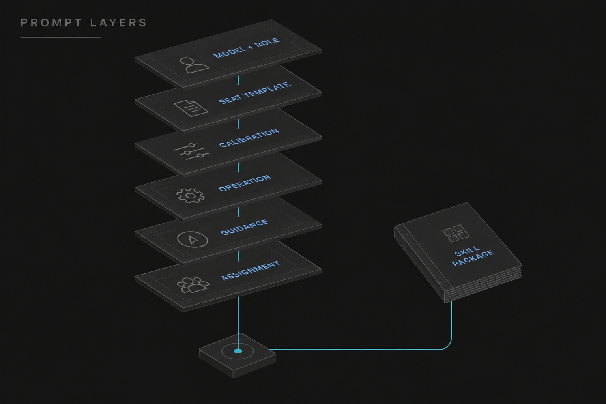

# Coder harnesses

*Conceptual illustration.*

| Layer | Owns |
|---|---|
| Model overlay | Exact model steering and declared effort |
| Seat template | Exact model + role contract |
| Calibration | Admitted guidance; optional lesson visibility caps |
| Native skill package | Reusable procedure in the CLI's discovery format |
| Engine | Routing, validation, diff application and evidence |

[Codex](codex.md) · [Claude](claude.md) · [Grok](grok.md) · [Kimi](kimi.md) · [Native skills](../skills.md)

## Shipped route order

| Seat | Ordered candidates |
|---|---|
| Coding | Codex → Sol → Fable coding → Opus coding |
| Review / bundle review | Fable → Opus → Astra |
| Review of review | Grok → Grok 4.5 → Kimi K3 → Kimi K2.5 → Astra → Fable |

Each candidate still needs its configured profile, available harness, allowed model and exact admitted identity. Missing role steering can skip a candidate; identity mismatches refuse.

*Conceptual illustration; exact composition appears above.*

## Output boundary

`Model output → validate → audit → engine applies → build → tests → independent review`

Coding returns a JSON unified diff. The engine applies and verifies it.

| Review language | Meaning |
|---|---|
| Seat-template guidance | PASS / BLOCK; CONFIRM / CHALLENGE |
| Validated Verdict outcome | Exact lowercase `approve` or `findings` |
| Second opinion | `approve` confirms the original decision; `findings` overturns it |
