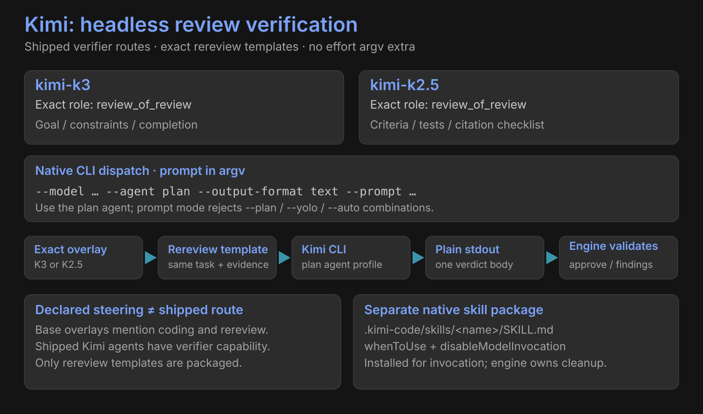

# Kimi



| Exact model | Shipped seat | Exact template | Steering |
|---|---|---|---|
| `kimi-k3` | review_of_review | rereview | Goal / constraints / completion criteria |
| `kimi-k2.5` | review_of_review | rereview | Criteria / tests / documentation / citations |

No effort argv extra is declared.

```text
--model … --agent plan --output-format text --prompt <prompt>
```

| Boundary | Behavior |
|---|---|
| Headless execution | Built-in `plan` agent profile; prompt in argv |
| Invalid combinations | Prompt mode rejects `--plan`, `--yolo`, `-y` and `--auto` |
| Seat-template guidance | CONFIRM / CHALLENGE |
| Output | Plain stdout; validated Verdict outcome is `approve` or `findings` |
| Native skill | `.kimi-code/skills/<name>/SKILL.md` |
| Inventory | Configured CLI model keys; exact steering still required |

Base overlays mention coding and review verification. Shipped Kimi agents have verifier capability, shipped routes use review verification, and only rereview templates are packaged. Overlay language does not create a coding route.

[All harnesses](index.md) · [Native skills](../skills.md)
