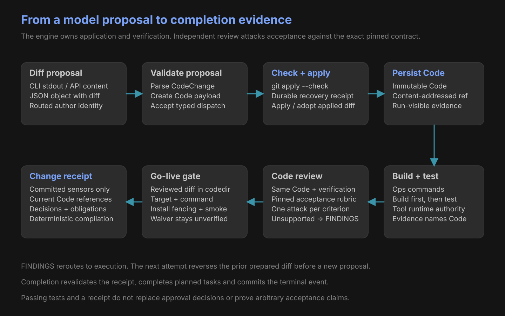

# Application and evidence

| Evidence | Must bind |
|---|---|
| Code | Validated diff and routed author |
| Verification | Exact current Code reference; executed apply, build and test |
| Code verdict | Code + verification + pinned acceptance rubric |
| Acceptance assessment | One criterion, concrete attack, evidence and supported flag |
| Go-live smoke | Run, gate, delivery unit, environment and Ops command |
| Waiver | Matching audited intervention; affected check remains unverified |
| Change receipt | Committed evidence, decisions, obligations and pinned snapshots |
| Completion | Fresh receipt validation + planned-task completion + terminal event |

| Guarded failure | Result |
|---|---|
| Invalid diff | Refuse before recovery preparation and application |
| Recovery receipt cannot persist | Refuse application and verification |
| Build fails | Preserve evidence; test remains unrun |
| Review acceptance unsupported | FINDINGS; return to author |
| Reviewed diff absent from codedir | Go-live refuses |
| Missing or stale committed sensor | Receipt refuses |

Event references establish authority. An uncommitted file or success claim cannot substitute for passing evidence.

[Architecture](architecture.md) · [Process order](processes.md) · [Model paths](cloud-models.md)
