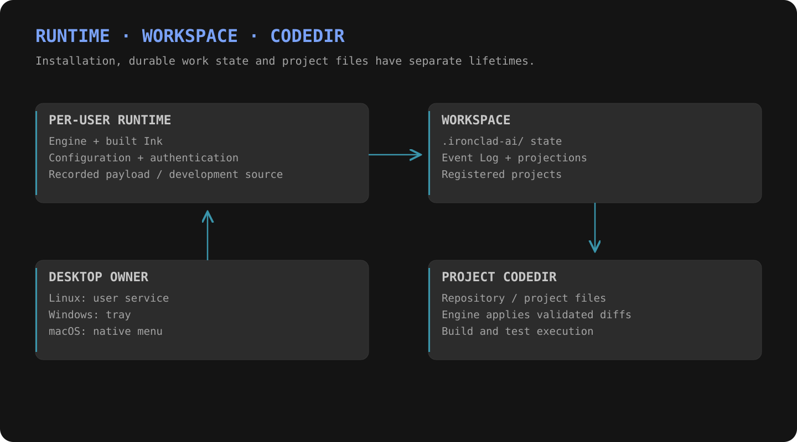

# Getting started

**Separate the installed runtime from the workspace it serves.**



| Host | Native engine | Desktop owner | Alternative |
|---|---|---|---|
| Linux | Supported | User service + session indicator | Docker |
| Windows | Supported | Login tray | Docker |
| macOS | Supported | Native menu | Docker |

> These are current product paths. This documentation repository provides no source checkout, installer or package download.

## With an installed runtime

```console
ironclad init --state-root /absolute/workspace
ironclad run --state-root /absolute/workspace
```

Use a platform-appropriate absolute workspace path. Initialization creates workspace state; `run` starts or attaches to its configured server and opens Ink.

```console
ironclad doctor --state-root /absolute/workspace
ironclad open console --state-root /absolute/workspace
ironclad open catalog --state-root /absolute/workspace
```

The browser commands require a running workspace server. They open a page after checking its identity.

## Choose the orchestrator model backend

| Need | Configure |
|---|---|
| API model | Endpoint, concrete model identity, egress, secret reference and pricing |
| Vendor CLI | Detected executable, available model and exact product overlay |
| Multiple CLI accounts | Explicit subscription binding and isolated vendor auth home |
| Replace the local model | CLI Shim routes the orchestrator through a vendor CLI to cloud inference; current backend: Codex CLI |

[Cloud models](cloud-models.md) · [Coder harnesses](coders/index.md)

## Run and update

`ironclad update` applies the recorded packaged payload or recorded development source. Linux/macOS can explicitly select a local payload archive. Configuration, authentication and workspace selection are retained.

Loopback is the default listener. A wider bind requires an active bearer-token profile.
