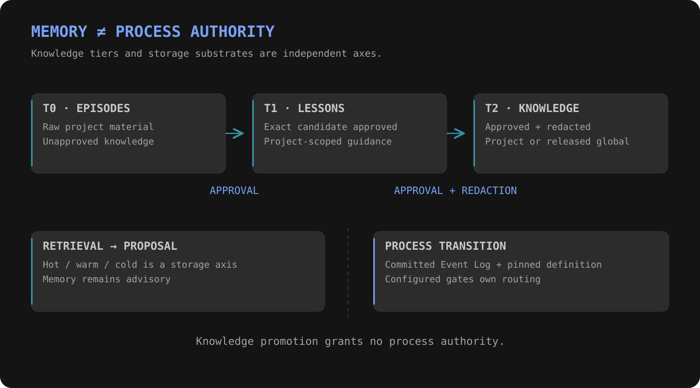

# Memory and learning

**Knowledge informs a proposal. Process state decides the transition.**

| Knowledge tier | Meaning | Write boundary |
|---|---|---|
| T0 | Raw project episodes | Project-local recording |
| T1 | Approved project lessons | Exact-candidate promotion approval |
| T2 | Project knowledge or released global knowledge | Exact-candidate approval and redaction |

## Storage is a separate axis

| Substrate | Role |
|---|---|
| Hot | Bounded context already selected for a consumer |
| Warm | Derived project-partitioned caches |
| Cold | Durable project-partitioned knowledge and search backing |

Moving data between substrates does not promote its knowledge tier. Approved memory remains advisory: it cannot authorize a process transition or replace the committed Event Log.

## Learning loop

Run evidence → reflection → lesson proposal → approval → project lesson → eligible future guidance.

Pending lessons do not become trusted memory through reflection alone.

[Architecture](architecture.md) · [Skills](skills.md) · [Evidence](evidence.md)
