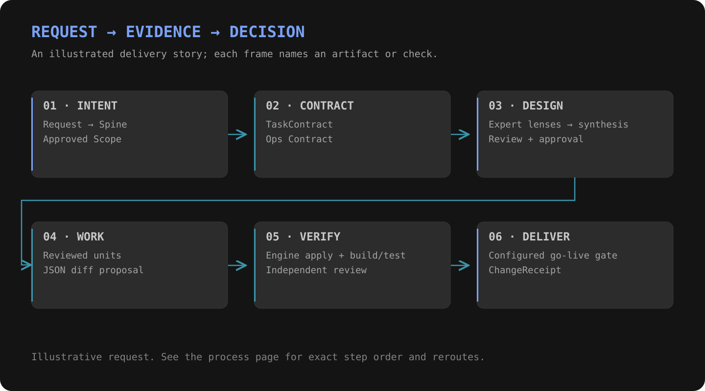

# One request, through the process

**Example: “Add a project export command.”**

| Frame | Produced evidence |
|---|---|
| 01 · Intent | Spine decision and approved scope |
| 02 · Contract | TaskContract and Ops Contract |
| 03 · Design | Expert lenses, synthesis, review and approval |
| 04 · Work | Reviewed units and a model-authored diff proposal |
| 05 · Verify | Engine-applied Code artifact, build and test evidence, independent review |
| 06 · Deliver | Configured go-live gate and terminal ChangeReceipt |

This is an illustrative request, not a claim that the example feature has shipped.

Review findings return to the producing step within the process's reroute bound. A configured approval or refusal pauses or routes the run according to its pinned definition.

[Full process](processes.md) · [Coder layers](coders/index.md) · [Evidence path](evidence.md)
