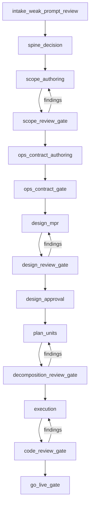
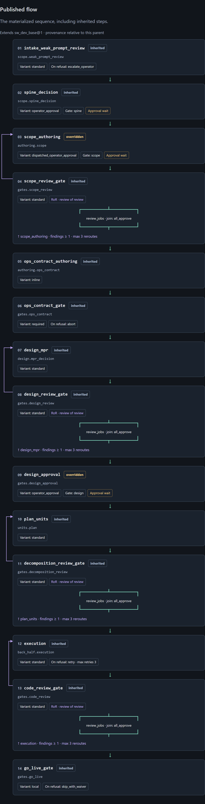
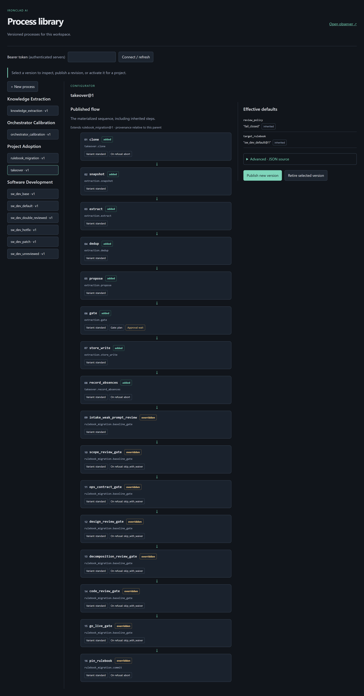
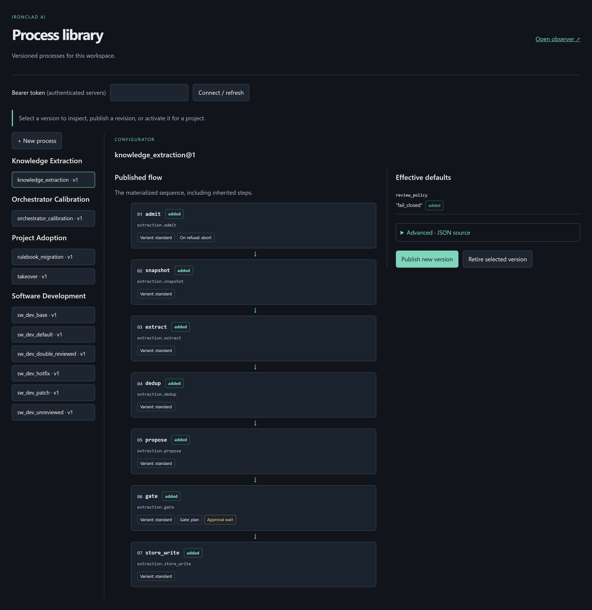

# Processes

A process in ironclad-ai is a versioned definition: `name@version`, an
explicit `use_case`, a `role` (`rulebook` or `operation`), optional
inheritance, and an ordered list of steps. The engine materializes the
inheritance chain, lints it against the step registry, and pins the
result to a run.

You inspect and publish these in the [process catalog](surfaces.md#process-catalog).

## Software development

The base sequence is fourteen steps. Children override variants and
defaults; they do not invent a second pipeline.

| Process | What changes relative to the base |
|---|---|
| `sw_dev_base` | Owns the sequence. Design approval auto-accepts after review. Scope is inline with operator approval. |
| `sw_dev_default` | Dispatched scope, operator design approval. This is the usual pin. |
| `sw_dev_double_reviewed` | Same steps; second opinion named explicitly on the four review gates. |
| `sw_dev_unreviewed` | Primary reviews remain. Review-of-review is off. |
| `sw_dev_patch` | Inherits default. `change_type: patch`. |
| `sw_dev_hotfix` | Inherits default. `change_type: hotfix`. |

Patch and hotfix currently run the same fourteen steps. The change-lane
matrix is policy data for the repository gate, not a second executable
filter.

Review gates fan out as `review_jobs`, join on unanimous approval, and
reroute to the authoring step when findings pass the threshold, up to
three times. That is what the purple arrows in the catalog are.

## Project adoption

**takeover** clones a Git repository into an empty product-created
codedir, runs the extraction pipeline, waits at the knowledge gate, records
baseline absences, then inherits rulebook migration and pins
`sw_dev_default`. The source directory is never registered in place.

**rulebook_migration** is for an existing unpinned project. Required
gates from the target rulebook run as unsatisfied baseline checks. Each
one advances only through the audited waiver route. The last step writes
stable baseline files and pins the rulebook. Old evidence from some other
run grants nothing.

## Knowledge extraction

Standalone. Intake is a connector id. `filesystem` is the shipped
connector: a bounded, redacted, read-only snapshot of the project root.
Extraction is deterministic — no LLM. Dedup consults T2. Remaining items
become exact-candidate proposals. The `plan` gate must approve before
`store_write` can append T2 rows.

## Orchestrator calibration

Standalone four-stage operation: exercise the configured orchestrator,
evaluate committed same-run evidence, verify with an independent
generation, persist only through the domain evidence gate. No operator
approval, no software-development lane.

## Publishing your own

The catalog's **New process** starts a definition with a name, version,
and use case. Publication requires a version greater than any previously
published revision of that name, including retired ones, and an exact
base reference when you extend a parent. Parent pins stay put when you
later publish a newer parent. Retired parents cannot be selected for new
publications.

Activation replaces a project's active rulebook. It does not mutate a
run that already pinned its snapshot.
