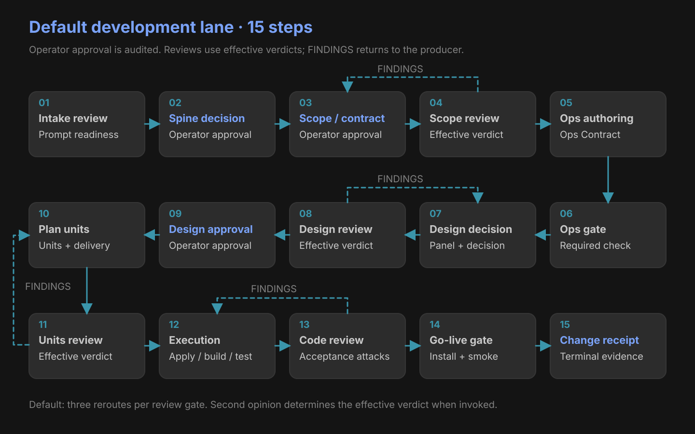

# Processes

| Lane | Steps | Difference |
|---|---:|---|
| Default | 15 | Dispatched Scope; Spine, Scope and Design operator approval |
| Base / double reviewed | 15 | Inline Scope; Design auto-accept policy; second opinion enabled |
| Unreviewed | 15 | First reviews remain; second opinions disabled |
| Patch / hotfix version 1 | 15 | Full default sequence; change policy differs |
| Patch version 2 | 10 | One scoped unit; no separate Design or decomposition review |
| Hotfix version 2 | 11 | Patch lane + follow-up Scope; tighter execution and review bounds |

| Review gate | FINDINGS target | Default reroute bound |
|---|---|---:|
| Scope | Scope authoring | 3 |
| Design | Design synthesis | 3 |
| Decomposition | Unit planning | 3 |
| Code | Execution | 3 |

| Runtime outcome | Transition |
|---|---|
| Approval required | Wait for an audited decision bound to the artifact |
| Effective review approval | Commit gate and advance |
| Effective review FINDINGS | Return to producer with persisted findings |
| Reroute bound exhausted | Wait for operator recovery instruction |
| Step refusal | Declared escalation, bounded retry, waiver or abort route |
| Terminal receipt accepted | Complete planned tasks and commit run completion |

Definitions choose executable steps. Runs retain their pinned order. The terminal receipt makes no model call.

[Architecture](architecture.md) · [Application and evidence](evidence.md)
