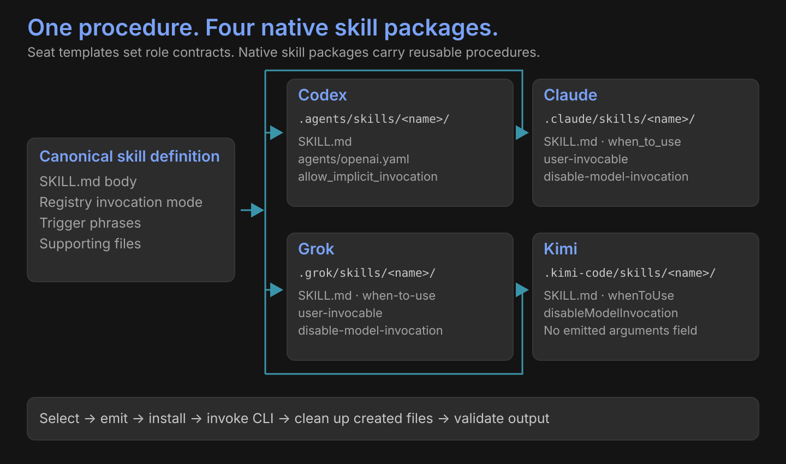

# Native skill packages

| Harness | Project directory | Native invocation controls |
|---|---|---|
| Codex | `.agents/skills/<name>/` | `agents/openai.yaml`: `policy.allow_implicit_invocation` |
| Claude | `.claude/skills/<name>/` | `when_to_use`, `user-invocable`, `disable-model-invocation` |
| Grok | `.grok/skills/<name>/` | `when-to-use`, `user-invocable`, `disable-model-invocation` |
| Kimi | `.kimi-code/skills/<name>/` | `whenToUse`, `disableModelInvocation` |

## One source, native formats

The emitter preserves the canonical skill body and supporting files. The registry selects invocation mode and trigger phrases. Claude and Grok may also emit an argument hint; Kimi emits no arguments field.

| Registry mode | Codex implicit policy | Claude / Grok disable flag | Kimi disable flag |
|---|---|---|---|
| Model | `true` | `false` | `false` |
| User | `false` | `true` | `true` |

## Invocation lifetime

`Select → emit → install → CLI runs → cleanup → validate output`

Only files created by the installation are removed. Identical existing files are preserved; conflicting files refuse. Cleanup finishes before output reaches assignment consumers.

[Coder harnesses](coders/index.md)
