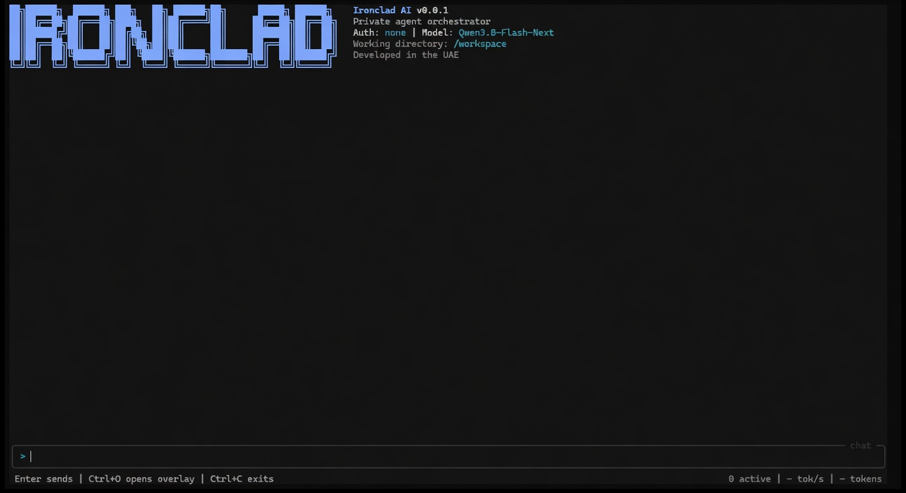
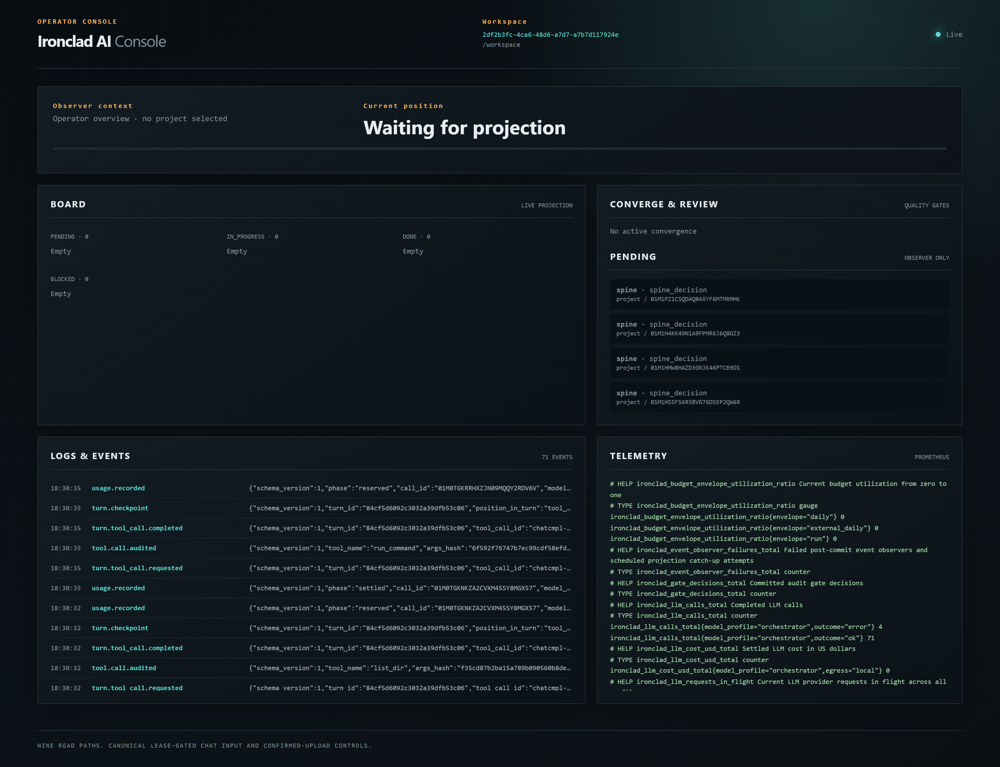
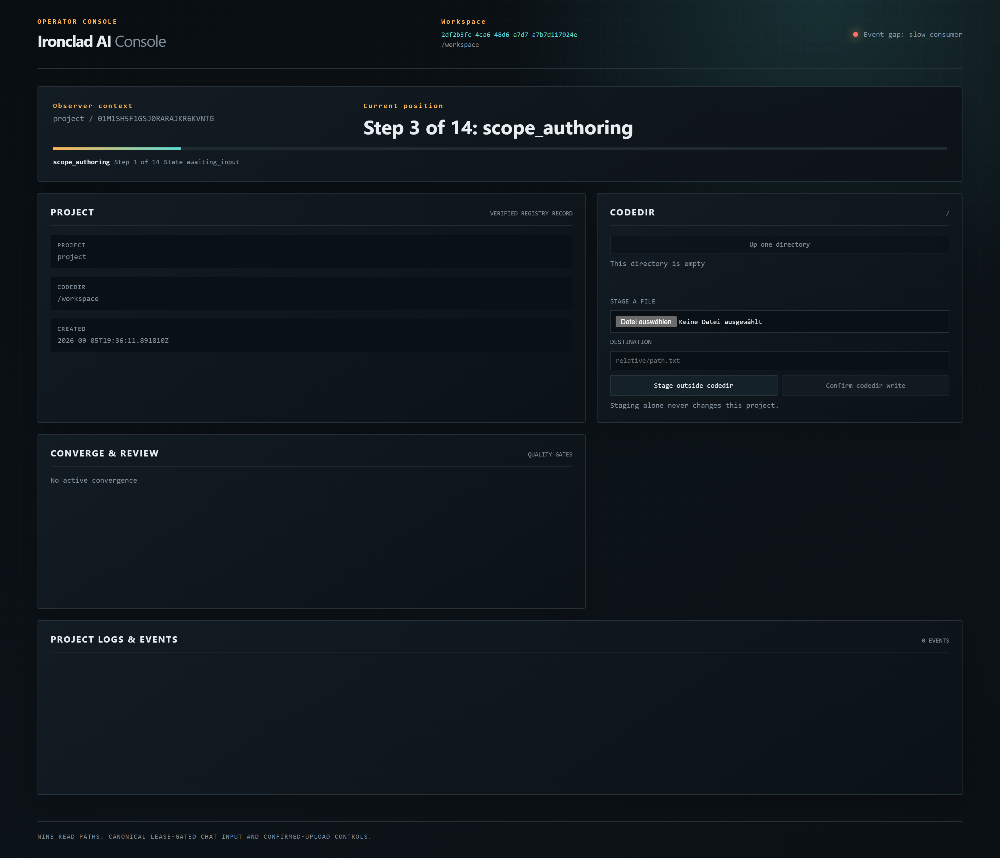
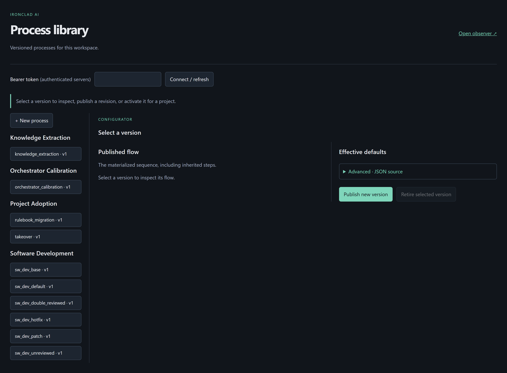

# Surfaces

ironclad-ai has one engine and several ways to sit in front of it. They are
not separate products. They are clients of `/api/v1`.

## Ink

Ink is the terminal client. If you are at a keyboard, this is the seat.

- Chat-first. The conversation is the main screen. The banner is scrollback,
  not a frozen header.
- `Ctrl+O` opens a full-width overlay: events, board, process position,
  pending approvals and learning proposals, turn history, incidents.
  `F1`–`F6` jump to those tabs. `Escape` closes the overlay. The
  conversation stays mounted underneath.
- Enter sends. While a turn is running, Ink asks once whether later
  messages should queue or steer. Steering does not cancel the active turn.
- Approvals and process control happen here. The catalog and the console
  do not submit those decisions.
- Markdown in assistant replies is a small, deliberate subset: bold,
  lists, tables. No fake browser inside the terminal.

```text
ironclad run
```

That creates a missing product runtime on first use, starts or attaches to
the workspace's loopback server, and opens Ink. When Ink exits, `run`
stops that matching server.

You can also point a standalone Ink at an already running engine:

```text
ironclad-ink --base-url http://127.0.0.1:8484
```



## Browser console

`http://127.0.0.1:8484/console` is the live operator view.

- Workspace identity is on the masthead so two tabs cannot silently look
  like the same server.
- Operator overview: event log, board, pending gates, Prometheus telemetry.
- Project view: registry record, codedir browse, stage-and-confirm upload,
  and — with `run_id` — process position.
- Chat exists only when `console.chat.enabled` is on. It uses the same
  input queue as Ink, behind a writer lease. It still does not approve.





## Process catalog

`ironclad serve --catalog` prints the catalog URL and holds the server.
Open `/catalog`.

- Library grouped by use case: software development, project adoption,
  knowledge extraction, calibration.
- Select a version to see the **materialized flow** — inherited, overridden,
  added, removed — with review forks, reroute arrows, converge loops, and
  approval-wait markers.
- JSON source lives in a collapsed advanced fold. Publishing lints the
  same way packaged definitions do.
- **Activate selected version** replaces a project's rulebook. Existing
  runs keep their snapshots. Operations such as takeover are not pinned
  as project rulebooks.

Ink remains the run-control and approval surface. The catalog does not
approve a live step.




## Engine CLI

The `ironclad` command belongs to the engine:

| Command | Purpose |
|---|---|
| `ironclad run` | Start or attach to this workspace's server, then open Ink |
| `ironclad serve` | Hold the HTTP server. `--catalog` prints the library URL |
| `ironclad update` | Apply the committed product to the per-user runtime |
| `ironclad config` | View and persist user configuration |
| `ironclad memory` | Reindex or forget rebuildable cold memory for a project |

`--state-root` selects a workspace start directory. Work-state always
lives at `.ironclad-ai/` beneath that directory. User config, auth, and
the runtime live in the per-user platform directory, not in the workspace.

## Python automation client

`ironclad-ai-client` is a typed HTTP library. It registers no console
script. Import it, point it at `/api/v1`, pass a bearer token when the
server is authenticated. Version mismatch against `/health` is an error,
not a silent downgrade.

## What none of these are

- Ink is not a local executor. Tools, files, and process state stay on
  the server.
- The console is not a second IDE. Uploads are staged outside the codedir
  and confirmed explicitly. Archives are opaque files.
- The catalog is not a workflow toy. Publication is linted, versioned,
  and occupancy-protected. You cannot retire the last published revision
  of a use case, or a revision a project still pins.
