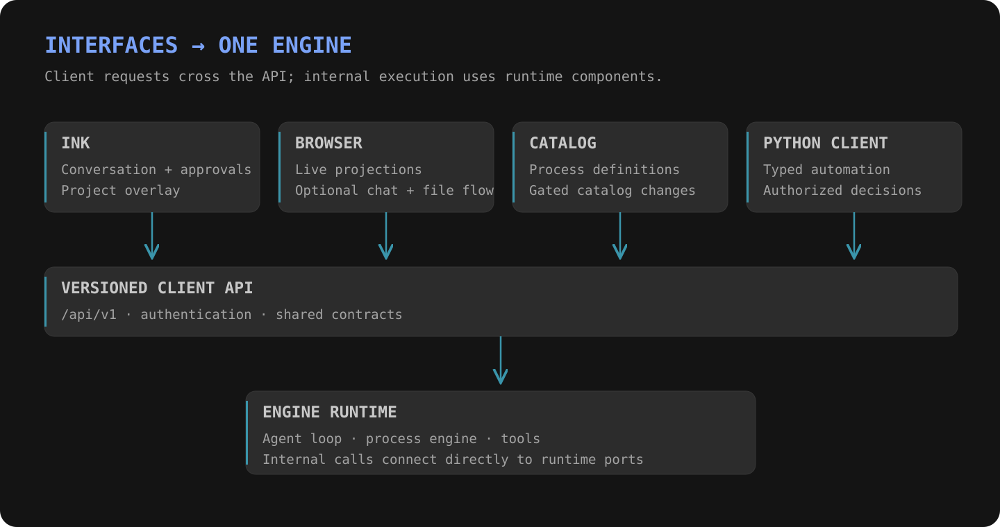

# Interfaces

**One engine. Several ways to use it.**

| Surface | Read | Act |
|---|---|---|
| Ink terminal | Conversation, projects, events, board, process position | Chat, steer, approvals and operations |
| Browser console | Events, board, position, pending gates, telemetry, project files | Optional lease-gated chat; stage and confirm file uploads |
| Process catalog | Library, pinned definitions and materialized flows | Gated catalog editing and publication |
| Python client | Typed versioned API | Authorized automation and approvals |
| Engine CLI | Health, configuration and workspace diagnostics | Start, run, update and manage the runtime |

Browser console pages display pending approvals. Approval submission remains in Ink and authorized automation.

## Terminal controls

| Control | Result |
|---|---|
| `Ctrl+O` | Project overlay: board, events, position, approvals, turns and incidents |
| `ironclad open console` | Open the selected running workspace's console |
| `ironclad open catalog` | Open its process catalog |

## Server lifetime

| Owner | After Ink exits |
|---|---|
| Linux user service | Server continues |
| Windows native tray | Server continues |
| macOS native menu | Server continues |
| Unmanaged server started or attached by `run` | Launcher stops it |

[Architecture](architecture.md) · [Getting started](getting-started.md)
